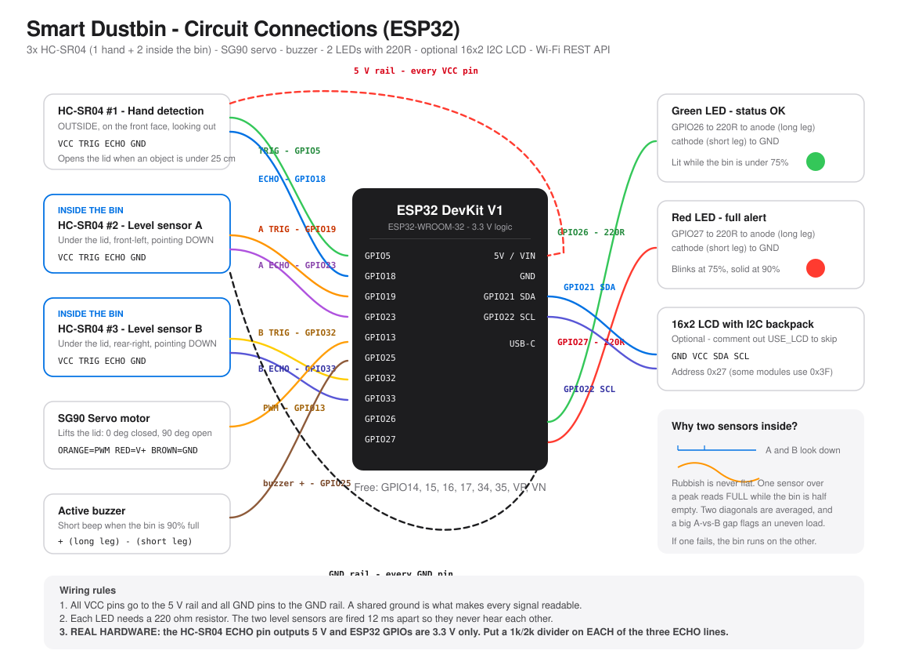

# Smart Dustbin — Industry Oriented Embedded System

Touchless automatic lid, dual-sensor waste-level monitoring, full-bin alerts,
and a live web dashboard for managing bins across a city.


### ▶ [**See it live**](https://snischayprasad.github.io/Smart-Dustbin-Embedded-System/website/)

| | |
|---|---|
| **Public city dashboard** | https://snischayprasad.github.io/Smart-Dustbin-Embedded-System/website/ |
| **Try the firmware** | [Live simulator](https://snischayprasad.github.io/Smart-Dustbin-Embedded-System/website/#simulation) — no sign-in needed |
| **Admin console** | [/login.html](https://snischayprasad.github.io/Smart-Dustbin-Embedded-System/website/login.html) — demo sign-in `Nischay` / `Admin@123` gives a **read-only** session; fleet control requires Google sign-in as a registered administrator |

On the public page, scroll to **Try the firmware yourself** and press
**Uneven pile (A 90 / B 10)** — that one button demonstrates the whole point
of the dual-sensor design, and needs no sign-in.

> **Built on the ESP32**, so the bin has Wi-Fi and a REST API and the dashboard
> can drive a real board. An Arduino UNO build is included as an alternative.
>
> **No hardware? No problem.** Import `simulation/wokwi/diagram.json` into
> [wokwi.com](https://wokwi.com) and the whole circuit appears, fully wired -
> Wi-Fi included, via the simulator's built-in `Wokwi-GUEST` network.

---

## Overview

An ordinary dustbin is a passive container. This one senses, decides, acts and
reports:

1. **It opens itself.** An ultrasonic sensor on the front detects a hand within
   25 cm and a servo lifts the lid. Nobody touches a dirty surface.
2. **It knows how full it is.** Two more ultrasonic sensors *inside* the bin,
   on opposite diagonals, measure the empty air above the rubbish. Their
   readings are fused into one fill percentage.
3. **It escalates sensibly.** Green under 75 %, blinking red from 75 %, solid
   red plus a short chirp at 90 %.
4. **It reports.** Telemetry over serial or Wi-Fi feeds a city dashboard that
   shows every bin on a map and lets an operator control them remotely.

---

## Problem statement

Two problems, one hygienic and one economic.

**Hygiene.** A public bin lid is one of the dirtiest surfaces in a building.
Every person who opens it passes whatever is on their hands to the next.
Removing the touch removes the pathway.

**Economics.** Waste collection normally runs on a *fixed schedule* — a van
visits every bin whether it needs it or not. Half the visits are to bins that
are nearly empty, which burns fuel and driver hours for nothing, while a
handful of bins in busy spots overflow long before the van is due. Fill-level
data replaces the timetable with evidence.

---

## Why two sensors inside the bin

This is the design decision worth understanding, because it is what separates
this project from the usual single-sensor smart bin.

**Rubbish is never flat.**

```
     [ sensor A ]                        [ sensor B ]
          |  ^                                |  ^
          |  | 3 cm                           |  | 27 cm
          |  v                                |  v
      ~~~~~~~~~~~~\
                   \~~~~~~~~~~~~~~~~~~~~~~~~~~~~
          ^ a peak                    a hollow ^
      ____|____________________________________|____   bin floor

   Sensor A alone says  90%  ->  "FULL, send a van"      (wrong)
   Sensor B alone says  10%  ->  "practically empty"     (wrong)
   Fused  (A+B)/2 says  50%  ->  correct, plus UNEVEN LOAD flagged
```

Two sensors on opposite diagonals buy three things at once:

| Benefit | How |
|---|---|
| **Accuracy** | Two points describe a lumpy surface far better than one |
| **Redundancy** | If one fails, the bin runs on the other and flags itself degraded, instead of going blind |
| **Diagnosis** | A gap of more than 25 points means the load is piled to one side — reported as `UNEVEN LOAD` |

Full worked numbers in [docs/12-bin-level-calculation.md](docs/12-bin-level-calculation.md).

---

## Features

- Touchless lid on a **four-state machine** with a safety re-open if a hand
  returns mid-close
- **Dual in-bin level sensors** fused into one percentage, with uneven-load
  detection and graceful single-sensor degradation
- Three-band alert policy — green / blinking red / solid red plus a 200 ms
  chirp every 2 s (not a continuous siren, which staff disable)
- **Non-blocking cooperative scheduler** — effectively no `delay()` in `loop()`
- Median-of-three filtering, range validation, echo timeouts, honest
  `SENSOR_ERROR` reporting
- Power-on self test that pings all three sensors and reports which answered
- Serial command set: `OPEN CLOSE AUTO MUTE UNMUTE EMPTY STATUS HELP`
- Optional 16x2 I2C LCD, compiled out entirely with one `#define`
- ESP32 variant exposing a REST API for genuine remote control
- **Public website + admin dashboard** with a live city map, remote commands
  and a collection-route planner
- **In-browser firmware simulator** on both pages — the real state machine
  ported to JavaScript, driven by three sensor sliders
- **Sign in with Google** (OAuth 2.0 / OIDC) with the ID token's RS256
  signature verified in-browser against Google's JWKS — not just decoded
- **Three-tier access** — owner, administrator, viewer — from a user registry
  where every address is stored as a hash; the public demo login is read-only
- **Owner-only user management console** that hashes new addresses in-browser
  and generates the registry file to commit
- **Optional Firestore store** so the admin list is shared and instant — with
  Security Rules enforcing owner-only writes **server-side**, which is the one
  place in this project where authorisation is not merely a UI convention
- **171 automated tests**, including 24 that try to get forged JWTs accepted

---

## Hardware

| Component | Qty | Purpose |
|---|---|---|
| **ESP32 DevKit V1** (or Arduino UNO) | 1 | Controller, Wi-Fi |
| HC-SR04 ultrasonic sensor | **3** | 1 hand detection + 2 in-bin level |
| SG90 servo motor | 1 | Lifts the lid |
| Green LED + 220 ohm | 1 | Normal status |
| Red LED + 220 ohm | 1 | Warning / full |
| Active buzzer | 1 | Full-bin alert |
| 16x2 I2C LCD | 1 | Local readout (optional) |
| 1 kΩ + 2 kΩ resistors | 3 pairs | ECHO level shifting (ESP32 only) |
| Breadboard, jumpers, 5 V/2 A supply | - | - |

Approximate total **1,500 INR** (the ESP32 is cheaper than an UNO). Zero if you simulate.

---

## Circuit



| Component | ESP32 GPIO | Arduino UNO pin |
|---|---|---|
| HC-SR04 #1 (hand, outside) | TRIG **5**, ECHO **18** | D2 / D3 |
| HC-SR04 #2 (level A, inside) | TRIG **19**, ECHO **23** | D4 / D5 |
| HC-SR04 #3 (level B, inside) | TRIG **32**, ECHO **33** | D8 / D9 |
| Servo signal | **13** | D6 |
| Buzzer | **25** | D7 |
| Green LED | **26** via 220 Ω | D10 |
| Red LED | **27** via 220 Ω | D12 |
| LCD | **21** SDA, **22** SCL | A4 / A5 |

> **On real ESP32 hardware, fit a 1 kΩ / 2 kΩ divider on each of the three
> ECHO lines.** The HC-SR04 drives 5 V and ESP32 GPIOs are 3.3 V only.
> Not needed on the UNO, and not needed in simulation.

Full tables, mounting guidance, the Wokwi pin-naming trap and the power
budget: [circuit_diagram/connections.md](circuit_diagram/connections.md).

---

## Embedded concepts demonstrated

| Concept | Where |
|---|---|
| GPIO input / output | TRIG, ECHO, LEDs, buzzer |
| Microsecond pulse timing | `pulseIn()` on the echo line |
| PWM | Servo angle control |
| Finite state machine | 4-state lid controller |
| Cooperative scheduling | `millis()` task dispatch, no `delay()` |
| Sensor fusion | Averaging two in-bin sensors plus a disagreement flag |
| Signal filtering | Median-of-three spike rejection |
| Threshold logic and status bands | 25 cm / 75 % / 90 % |
| Calibration | Measuring the true empty-bin distance |
| Fault handling | Timeouts, sentinels, degraded mode, error blink |
| UART protocol design | Human line plus JSON line telemetry |
| Conditional compilation | `#ifdef USE_LCD` feature flag |
| Wireless / IoT | Wi-Fi station mode, HTTP server, REST API with CORS |

---

## Bin level formula

```
fillLevel   = BIN_HEIGHT_CM - measuredDistance
fillPercent = (fillLevel / BIN_HEIGHT_CM) x 100
fused       = (fillA + fillB) / 2
uneven      = |fillA - fillB| > 25
```

With `BIN_HEIGHT_CM = 30`:

| Distance | 30 cm | 22.5 cm | 15 cm | 7.5 cm | 3 cm | 0 cm |
|---|---|---|---|---|---|---|
| **Fill** | 0 % | 25 % | 50 % | 75 % | 90 % | 100 % |
| **Status** | OK | OK | OK | WARNING | FULL | FULL |

---

## Quick start

### Simulate (no hardware)

1. Open [wokwi.com](https://wokwi.com), then **New Project > ESP32**
2. Paste [`simulation/wokwi/diagram.json`](simulation/wokwi/diagram.json) into the **diagram.json** tab
3. Paste [`simulation/wokwi/sketch.ino`](simulation/wokwi/sketch.ino) into the **sketch.ino** tab
4. Install **ESP32Servo** and **LiquidCrystal I2C** when prompted
5. Press play, then click a sensor to change its distance

Wi-Fi works in the simulator via `Wokwi-GUEST`, so the built-in status page
and the REST API are live. An Arduino UNO variant is in
[`simulation/wokwi/uno/`](simulation/wokwi/uno/).

### Real hardware - ESP32

1. Arduino IDE: add the ESP32 board package, install **ESP32Servo** and
   **LiquidCrystal I2C**
2. Wire per the table above, **including the three ECHO dividers**
3. Board: **ESP32 Dev Module**. Open
   `arduino_code/05_esp32_wifi_version/` and upload
4. Serial Monitor at **115200 baud**, line ending **Newline**
5. Put your own Wi-Fi SSID and password at the top of the sketch

### Real hardware - Arduino UNO

1. Install the **Servo** and **LiquidCrystal I2C** libraries
2. Open `arduino_code/04_smart_dustbin_complete/` and upload
3. Serial Monitor at **9600 baud**, line ending **Newline**

### Website and dashboard

```bash
node server/server.js
```

Open <http://localhost:3000>, or just double-click `website/index.html`.

Admin login: **`Nischay`** / **`Admin@123`**

### Run the tests

```bash
node tests/twin.test.js
```

```bash
node tests/oauth.test.js
```

```bash
node tests/users.test.js
```

```bash
node tests/store.test.js
```

---

## Sample output

```
==================================================
   SMART DUSTBIN - EMBEDDED SYSTEM (ESP32)
   Device  : BIN-001
   Firmware: v2.0.0-wifi
   Sensors : 1 hand + 2 in-bin level (A and B)
   Bin height     : 30.0 cm
   Hand threshold : 25.0 cm
   Warn / Full    : 75 % / 90 %
   Uneven-load gap: 25 %
==================================================
Power-on self test ... outputs OK
Sensor check: HAND OK | LEVEL-A OK | LEVEL-B OK
Connecting to Wi-Fi...
Connected. Dashboard URL: http://10.13.37.2
HTTP server started on port 80
System running. Type HELP for commands.

>>> Hand detected - opening lid
[32s] Hand=12.0cm | Lid=OPEN | A=88% B=14% | Fill=51% | Status=OK | Opens=1 | UNEVEN LOAD
        [##########----------]
{"id":"BIN-001","fill":51,"fillA":88,"fillB":14,"spread":74,"uneven":true,"sensors":2,...}
```

A full captured session is in
[`data/sample_serial_output.txt`](data/sample_serial_output.txt).

---

## Verification

Every sketch was compiled with `arduino-cli` against the real toolchains.

| Check | Result |
|---|---|
| `05_esp32_wifi_version` (ESP32) | 983,221 B flash (75 %), 46,144 B RAM (14 %) |
| `04_smart_dustbin_complete` (UNO) | 16,640 B flash (51 %), 836 B RAM (40 %) |
| `01_lid_module` (UNO) | 5,434 B flash (16 %) |
| `02_bin_level_module` (UNO) | 6,318 B flash (19 %) |
| `03_alert_module` (UNO) | 4,056 B flash (12 %) |
| `src/` modular build (UNO) | 13,414 B flash (41 %) |
| Compiler warnings (`--warnings all`) | none from project code |
| `node tests/twin.test.js` | 64 passed, 0 failed |
| `node tests/oauth.test.js` | 24 passed, 0 failed (forgery attempts all rejected) |
| `node tests/users.test.js` | 48 passed, 0 failed (access control, no real addresses) |
| `node tests/store.test.js` | 35 passed, 0 failed (cloud store, outage and refusal cases) |
| Wokwi ESP32 circuit import | 11 parts, 27 connections, all 16 board pins resolve |

---

## Project structure

```
Smart-Dustbin-Embedded-System/
├── src/                  Modular firmware (config, drivers, FSM, fusion)
├── arduino_code/         5 ready-to-upload sketches, built up in stages
├── simulation/           Wokwi circuit + Tinkercad instructions
├── circuit_diagram/      Wiring SVG, pin tables, power budget
├── website/              Public site + admin dashboard
├── server/               Optional zero-dependency Node backend
├── tests/                64 automated logic assertions
├── data/                 Seed fleet, calibration table, captured output
├── docs/                 19 documentation sections
├── screenshots/          Proof images
└── reports/              Project report
```

[Full explanation of every folder](docs/08-folder-structure.md)

---

## Documentation

| # | Document |
|---|---|
| 01 | [Project explanation](docs/01-project-explanation.md) |
| 02 | [Industry relevance](docs/02-industry-relevance.md) |
| 03 | [Tech stack options](docs/03-tech-stack-options.md) |
| 04 | [Embedded concepts used](docs/04-embedded-concepts.md) |
| 05 | [Hardware components](docs/05-components.md) |
| 06 | [Project architecture](docs/06-architecture.md) |
| 07 | [Implementation plan](docs/07-implementation-plan.md) |
| 08 | [Folder structure](docs/08-folder-structure.md) |
| 09 | [Circuit diagram](docs/09-circuit-diagram.md) |
| 10 | [Source code guide](docs/10-source-code-guide.md) |
| 11 | [Virtual simulation](docs/11-virtual-simulation.md) |
| 12 | [Bin level calculation](docs/12-bin-level-calculation.md) |
| 13 | [Testing strategy](docs/13-testing-strategy.md) |
| 14 | [How to run](docs/14-how-to-run.md) |
| 15 | [GitHub strategy](docs/15-github-strategy.md) |
| 16 | [Website and dashboard](docs/16-website-guide.md) |
| 17 | [Proof building plan](docs/17-proof-plan.md) |
| 18 | [Screenshot checklist](docs/18-screenshot-checklist.md) |
| 19 | [Interview preparation](docs/19-interview-preparation.md) |

---

## Known limitations

Stated deliberately - knowing the boundaries of your design is part of the
engineering.

- **The servo is open loop.** There is no position feedback, so the firmware
  cannot detect a jammed lid. A limit switch or current sensing would fix it.
- **Two sensors sample two points, not a volume.** A narrow spike exactly
  between A and B is still invisible.
- **No temperature compensation.** The speed of sound shifts about 0.6 m/s per
  degree C - negligible indoors, a real error on a bin standing in the sun.
- **Authentication is real, authorisation is not.** Google sign-in genuinely
  verifies an ID token's signature, but with no server and no protected API
  the dashboard state still lives in `localStorage` and is editable from
  DevTools. Real authorisation needs the server to verify the token on every
  request — `server/server.js` shows that shape.
- **Wi-Fi is the wrong radio for street furniture.** A real deployment would
  use LoRaWAN or NB-IoT with deep sleep.

---

## Future improvements

- Deep sleep plus LoRaWAN/NB-IoT for year-long battery life
- Limit switch or current sensing for closed-loop lid control
- Temperature-compensated speed of sound (DHT22)
- Tamper and fire detection (accelerometer plus thermistor)
- Signed over-the-air firmware updates
- Waste segregation using an inductive or capacitive sensor
- Solar charging for outdoor units

---

## Learning outcomes

- Reading a sensor by timing a pulse to microsecond accuracy
- Driving an actuator with PWM
- Designing a finite state machine, and why it beats a boolean
- Writing non-blocking firmware with a cooperative scheduler
- Fusing redundant sensors and degrading gracefully when one fails
- Calibrating against physical reality instead of trusting a datasheet
- Designing an alert policy people will not disable
- Testing embedded logic automatically, including fault injection
- Building a front end that turns telemetry into an operational decision

---

## Author

**Nischay**
Malla Reddy College of Engineering and Technology
Embedded Systems course project

---

## License

MIT - see [`LICENSE`](LICENSE).
